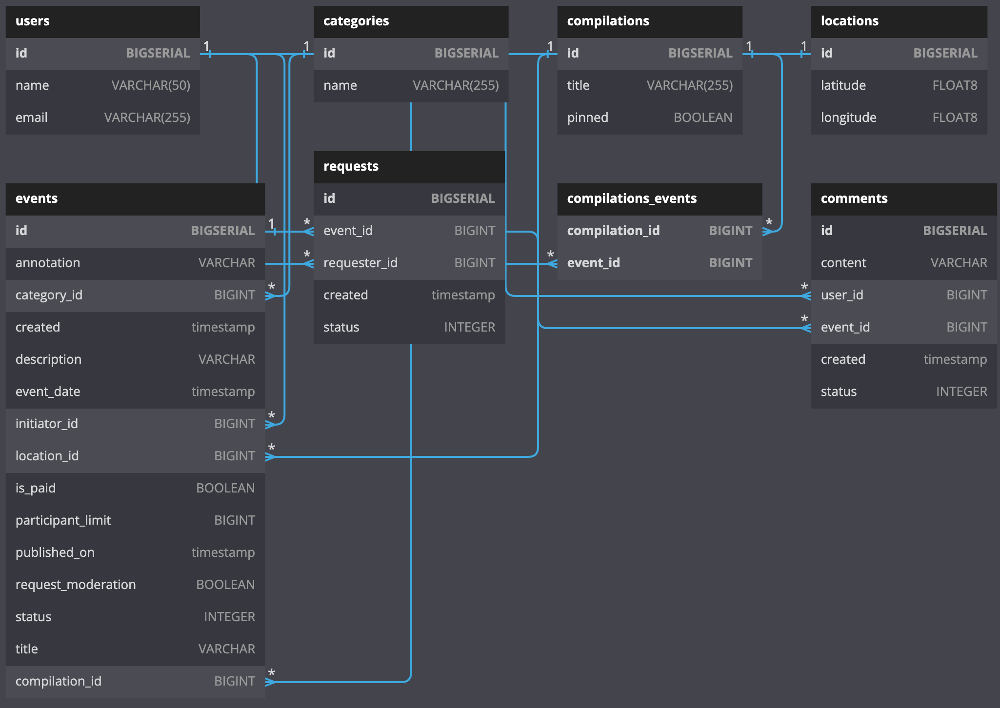
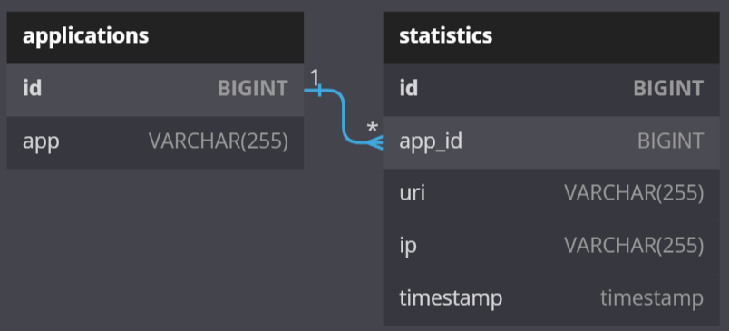

# java-explore-with-me
Приложение позволяет делиться информацией об интересных событиях и помогает найти компанию для участия в них
## Технологический Стек
- Java 11
- Spring Boot 2.7.0
- PostgreSQL 42.3
- Maven сборка
## Архитектура
Приложение основано на микросервисной архитектуре и состоит из двух сервисов
- EWM основной сервис ([API](ewm-main-service-spec.json))
- STATS сервис статистики — хранит количество просмотров и позволяет делать различные выборки для анализа работы приложения ([API](ewm-stats-service-spec.json))

У каждого из сервисов есть отдельная база данных PostgreSQL

ER diagram EWM

ER diagram STATS


## Запуск проекта
Для запуска проекта потребуется:
- Docker 20+ 
- Docker-compose 2.10+

(manual) В терминале выполнить команды:
```
git clone git@github.com:latarho/java-explore-with-me.git
cd java-explore-with-me
mvn package
docker-compose up -d
```
https://github.com/Latarho/java-explore-with-me/pull/1